# 🏗️ Enterprise Flask E-Commerce Architecture

[](https://python.org)
[](https://flask.palletsprojects.com)
[](https://postgresql.org)
[](https://redis.io)
[](https://kubernetes.io)
[](LICENSE)

A production-ready, enterprise-grade e-commerce platform architecture built with Flask, featuring Domain-Driven Design (DDD), Zero-Trust security, event-driven microservices, and AI-powered personalization.

## 📋 Table of Contents

- [Overview](#-overview)
- [Architecture Diagram](#-architecture-diagram)
- [Key Features](#-key-features)
- [Technology Stack](#-technology-stack)
- [Project Structure](#-project-structure)
- [Data Flows](#-critical-data-flows)
- [Deployment](#-deployment-topology)
- [Observability](#-observability-stack)

## 🎯 Overview

This architecture represents a scalable, secure, and maintainable e-commerce platform designed for high-traffic production environments. It implements modern software engineering principles including:

- **Domain-Driven Design (DDD)** for business logic organization
- **CQRS-lite** pattern for read/write separation
- **Event-Driven Architecture** for loose coupling
- **Zero-Trust Security** model with defense in depth
- **AI/ML Integration** for personalization and search

## 🗺️ Architecture Diagram

```mermaid
flowchart TB
    subgraph Clients["👥 Client & API Layer"]
        direction TB
        subgraph WebClients["Web Clients"]
            SPA["⚛️ Next.js / Vue SPA"]
            PWA["📲 PWA Support"]
            AdminUI["👨‍💼 Admin Dashboard"]
        end
        subgraph APIGateway["API Gateway"]
            GraphQL["🍓 GraphQL<br/>Strawberry/Ariadne"]
            REST["📡 REST API<br/>Flask-RESTful"]
            WebSocket["🔌 WebSocket<br/>Flask-SocketIO"]
        end
        subgraph ExternalAccess["External Access"]
            Mobile["📱 Mobile Apps"]
            PartnerAPI["🤝 Partner API<br/>Rate-limited tokens"]
        end
    end

    subgraph Edge["🌐 Edge / CDN"]
        CDN["☁️ CloudFlare CDN"]
        ImageCDN["🖼️ Image CDN<br/>Cloudinary"]
        LB["⚖️ Load Balancer<br/>nginx / Traefik"]
        SSL["🔒 SSL/TLS 1.3"]
    end

    subgraph Security["🛡️ Security Layer (Zero-Trust)"]
        subgraph AuthN["Authentication"]
            JWT["🔐 JWT + Refresh<br/>15min / 7d rotation"]
            OAuth["🎫 OAuth2 / OIDC"]
            MFA["📱 MFA / 2FA<br/>Twilio Verify"]
        end
        subgraph AuthZ["Authorization"]
            RBAC["👥 RBAC<br/>Flask-Principal"]
            APIKeyRotation["🔑 API Key Rotation"]
        end
        subgraph Protection["Protection"]
            Talisman["🛡️ Flask-Talisman<br/>CSP, HSTS"]
            RateLimit["🚦 Rate Limiter"]
            CSRF["🚫 CSRF + Validation"]
        end
        AuditLog["📋 Audit Logging"]
    end

    subgraph Application["🧠 Application Layer (DDD)"]
        subgraph Core["Core"]
            Flask["⚙️ Flask App<br/>Gunicorn + gevent"]
            DI["💉 Flask-Injector<br/>Dependency Injection"]
        end
        subgraph Presentation["Presentation"]
            Blueprints["🌐 Blueprints"]
            Schemas["📋 Marshmallow DTOs"]
            Jinja["🧩 Jinja2 SSR"]
        end
        subgraph Domain["Domain"]
            DomainModels["🏛️ Domain Models"]
            DomainServices["⚙️ Domain Services"]
        end
        subgraph Infra["Infrastructure"]
            Repositories["🗃️ Repositories"]
            Adapters["🔧 Adapters"]
        end
    end

    subgraph Services["⚡ Business Services"]
        subgraph CoreCommerce["Core Commerce"]
            CartSvc["🛒 cart_service"]
            OrderSvc["📃 order_service"]
            InventorySvc["📦 inventory_service"]
            PricingSvc["💰 pricing_service"]
        end
        subgraph UserAuth["User & Auth"]
            AuthSvc["👤 auth_service"]
            UserSvc["🪪 user_service"]
        end
        subgraph Discovery["Discovery"]
            SearchSvc["🔍 search_service"]
            AnalyticsSvc["📊 analytics_service"]
        end
        subgraph Comms["Communication"]
            NotifSvc["📧 notification_service"]
            TrackingSvc["📍 tracking_service"]
        end
    end

    subgraph Data["🗄️ Data Layer"]
        subgraph Primary["Primary Storage"]
            Postgres[("🐘 PostgreSQL<br/>Primary + Replicas")]
            Alembic["🔄 Alembic Migrations"]
            PgBouncer["🏊 pgBouncer"]
        end
        subgraph Cache["Caching"]
            Redis[("⚡ Redis Cluster")]
            RedisStreams["🌊 Redis Streams<br/>CDC / Events"]
        end
        subgraph SearchAnalytics["Search & Analytics"]
            Elastic[("🔎 Elasticsearch")]
            Warehouse[("📈 BigQuery/Snowflake")]
        end
        S3[("📁 S3 / GCS")]
    end

    subgraph Async["🔄 Async & Workers"]
        subgraph TaskQueue["Task Queue"]
            Celery["🥬 Celery Workers"]
            Flower["🌸 Flower Monitor"]
            RetryDLQ["🔁 Retry + DLQ"]
        end
        subgraph Streaming["Message Streaming"]
            RabbitMQ["🐰 RabbitMQ"]
            Kafka["📬 Kafka"]
        end
        subgraph Tasks["Task Types"]
            EmailTasks["📧 Email Tasks"]
            Webhooks["🔔 Webhooks"]
            SyncJobs["🔄 Sync Jobs"]
        end
        OTel["🔭 OpenTelemetry"]
    end

    subgraph Infrastructure["☸️ Infrastructure & DevOps"]
        subgraph Orchestration["Orchestration"]
            Docker["🐳 Docker"]
            K8s["☸️ Kubernetes<br/>Helm Charts"]
            BlueGreen["🔄 Blue-Green Deploy"]
        end
        subgraph CICD["CI/CD"]
            GHA["🔧 GitHub Actions"]
            ArgoCD["🏗️ ArgoCD GitOps"]
        end
        subgraph Observability["Observability"]
            Prometheus["📊 Prometheus"]
            Grafana["📈 Grafana"]
            Loki["📝 Loki"]
            Sentry["🚨 Sentry"]
        end
        Vault["🔐 HashiCorp Vault"]
    end

    subgraph AI["🤖 AI & Personalization"]
        subgraph Recommendations["Recommendations"]
            RecEngine["🎯 Rec Engine<br/>scikit-learn/TF"]
            CollabFilter["👀 Collaborative Filter"]
        end
        subgraph SmartSearch["Smart Search"]
            SemanticSearch["🧠 Semantic Search<br/>BM25 + Embeddings"]
            QueryExpansion["✨ Query Expansion"]
        end
        subgraph Conversational["Conversational"]
            Chatbot["🤖 Support Chatbot<br/>Rasa / Claude"]
            OrderAssistant["💬 Order Assistant"]
        end
    end

    subgraph External["🌍 External Services"]
        subgraph Payments["Payments"]
            Stripe["💳 Stripe"]
            PayPal["🅿️ PayPal"]
        end
        subgraph Communications["Communications"]
            SendGrid["📬 SendGrid"]
            Twilio["📱 Twilio"]
        end
        subgraph Logistics["Logistics"]
            ShippingAPI["🚚 Shipping APIs"]
            AddressVerify["📍 Address Verify"]
        end
    end

    SPA --> CDN
    PWA --> CDN
    AdminUI --> CDN
    Mobile --> LB
    PartnerAPI --> LB
    CDN --> ImageCDN
    CDN --> LB
    LB --> SSL
    
    SSL --> RateLimit
    RateLimit --> JWT
    RateLimit --> OAuth
    JWT --> MFA
    OAuth --> MFA
    MFA --> RBAC
    RBAC --> Talisman
    Talisman --> CSRF
    CSRF --> AuditLog

    AuditLog --> Flask
    Flask --> DI
    DI --> Blueprints
    Blueprints --> GraphQL
    Blueprints --> REST
    Blueprints --> WebSocket

    GraphQL --> Schemas
    REST --> Schemas
    Schemas --> DomainServices
    DomainServices --> DomainModels
    DomainModels --> Repositories
    Repositories --> Adapters

    Adapters --> CartSvc
    Adapters --> OrderSvc
    Adapters --> InventorySvc
    Adapters --> PricingSvc
    Adapters --> AuthSvc
    Adapters --> UserSvc
    Adapters --> SearchSvc
    Adapters --> AnalyticsSvc
    Adapters --> NotifSvc
    Adapters --> TrackingSvc

    CartSvc --> Redis
    OrderSvc --> Postgres
    InventorySvc --> Postgres
    PricingSvc --> Redis
    AuthSvc --> Postgres
    UserSvc --> Postgres
    SearchSvc --> Elastic
    AnalyticsSvc --> Warehouse
    NotifSvc --> Redis
    TrackingSvc --> RedisStreams

    Postgres --> PgBouncer
    Postgres --> Alembic
    RedisStreams --> Kafka

    OrderSvc --> Celery
    InventorySvc --> Celery
    Celery --> Flower
    Celery --> RetryDLQ
    Celery --> EmailTasks
    Celery --> Webhooks
    Celery --> SyncJobs
    Kafka --> Celery
    RabbitMQ --> Celery
    Celery --> OTel

    SearchSvc --> SemanticSearch
    SemanticSearch --> QueryExpansion
    QueryExpansion --> Elastic
    SearchSvc --> RecEngine
    RecEngine --> CollabFilter
    NotifSvc --> Chatbot
    Chatbot --> OrderAssistant

    OrderSvc --> Stripe
    OrderSvc --> PayPal
    EmailTasks --> SendGrid
    NotifSvc --> Twilio
    OrderSvc --> ShippingAPI
    UserSvc --> AddressVerify

    Flask --> Docker
    Docker --> K8s
    K8s --> BlueGreen
    GHA --> ArgoCD
    ArgoCD --> K8s
    Flask --> Prometheus
    Prometheus --> Grafana
    Flask --> Loki
    Flask --> Sentry
    Flask --> Vault
```



## ✨ Key Features

### 🔐 Security Layer (Zero-Trust)

| Component | Technology | Purpose |
|-----------|------------|---------|
| Secure Headers | Flask-Talisman | CSP, HSTS, X-Frame-Options |
| MFA | Twilio Verify / TOTP | Second-factor authentication |
| RBAC | Flask-Principal | Role-based access control |
| JWT Flow | PyJWT | 15min access + 7d refresh tokens |
| API Keys | Custom + Redis | Auto-rotation, expiry, audit |
| Audit Log | Structured JSON | Admin action trails |

### 🌐 Client & API Layer

| Component | Technology | Purpose |
|-----------|------------|---------|
| GraphQL Gateway | Strawberry / Ariadne | Flexible queries for mobile/partners |
| Modern Frontend | Next.js / Vue SPA | Reactive UI consuming Flask API |
| PWA Support | Service Workers | Offline browsing, push notifications |
| Partner API | Rate-limited tokens | Third-party integrations |
| Real-time | Flask-SocketIO | Order tracking, notifications |

### 🗄️ Data & Persistence Layer

| Component | Technology | Purpose |
|-----------|------------|---------|
| Primary DB | PostgreSQL + Replicas | ACID transactions, read scaling |
| Migrations | Alembic | Schema versioning |
| Connection Pool | pgBouncer | Connection efficiency |
| Cache | Redis Cluster | Sessions, cart, response cache |
| Event Stream | Redis Streams | CDC, async communication |
| Search | Elasticsearch | Product index, faceted search |
| Analytics | BigQuery / Snowflake | Data warehouse, BI |
| Objects | S3 / GCS | Product images, assets |

### 🤖 AI & Personalization

| Component | Technology | Purpose |
|-----------|------------|---------|
| Recommendations | scikit-learn / TF Lite | "You might also like" |
| Collaborative Filter | User-item matrix | Behavior-based suggestions |
| Semantic Search | BM25 + Embeddings | Natural language queries |
| Query Expansion | Synonyms, typo handling | Better search recall |
| Chatbot | Rasa / Claude API | Order support, FAQs |

## 🛠️ Technology Stack

**Backend:** Python 3.11+, Flask 3.0, Gunicorn, gevent

**API:** GraphQL (Strawberry/Ariadne), REST (Flask-RESTful), WebSocket (Flask-SocketIO)

**Database:** PostgreSQL 16, Redis 7, Elasticsearch 8

**Queue/Streaming:** Celery, RabbitMQ, Kafka

**Infrastructure:** Docker, Kubernetes, Helm, ArgoCD

**Observability:** Prometheus, Grafana, Loki, Sentry, OpenTelemetry

**Security:** Flask-Talisman, PyJWT, OAuth2/OIDC, HashiCorp Vault

## 📁 Project Structure

```
/app
├── /domain
│   ├── entities/        # User, Product, Order, Cart
│   ├── value_objects/   # Money, Address, Email
│   ├── services/        # PricingService, InventoryService
│   ├── events/          # OrderPlaced, PaymentReceived
│   └── exceptions/      # InsufficientStock, InvalidPayment
├── /infrastructure
│   ├── persistence/     # SQLAlchemy repos, Alembic
│   ├── cache/           # Redis client, decorators
│   ├── messaging/       # Kafka producer, Celery tasks
│   ├── external/        # Stripe, SendGrid adapters
│   └── search/          # Elasticsearch client
├── /presentation
│   ├── api/             # REST blueprints, GraphQL resolvers
│   ├── schemas/         # Marshmallow request/response DTOs
│   ├── websocket/       # SocketIO handlers
│   └── middleware/      # Auth, CORS, logging
└── /application
    ├── commands/        # PlaceOrder, UpdateCart
    ├── queries/         # GetOrderHistory, SearchProducts
    └── handlers/        # Command/query handlers (CQRS-lite)
```

## 🔀 Critical Data Flows

### Checkout Flow
```
SPA → GraphQL → JWT+MFA → RBAC → cart_service → pricing_service 
→ order_service → Kafka Event → Stripe → Webhook → Celery 
→ notification_service → WebSocket Push
```

### AI-Powered Search
```
Query → GraphQL → search_service → Query Expansion → ES BM25 
→ Embedding Rerank → Rec Engine Boost → Redis Cache → Response
```

### Zero-Trust Authentication
```
Login → Rate Limit → CSRF → auth_service → PostgreSQL 
→ MFA Challenge → Twilio Verify → JWT (15m) + Refresh (7d) 
→ Redis Session → Audit Log
```

### Real-Time Order Tracking
```
Shipping Webhook → tracking_service → Redis Pub/Sub 
→ Flask-SocketIO → WebSocket Push → PWA Notification
```

## 🚀 Deployment Topology

```yaml
Namespaces:
  - production
  - staging
  
Deployments:
  - flask-api (3 replicas, HPA)
  - celery-worker (5 replicas)
  - celery-beat (1 replica)
  - flower (1 replica)
  
StatefulSets:
  - postgresql-primary
  - postgresql-replica (2)
  - redis-cluster (6 nodes)
  - elasticsearch (3 nodes)
  
Services:
  - flask-api (ClusterIP)
  - postgresql (ClusterIP)
  - redis (ClusterIP)
  
Ingress:
  - api.store.com → flask-api
  - admin.store.com → flask-api (admin routes)
  - ws.store.com → flask-socketio
```

## 📊 Observability Stack

```
┌─────────────────────────────────────────────────────────┐
│                     Grafana Dashboards                  │
├─────────────┬─────────────┬─────────────┬──────────────┤
│   Metrics   │    Logs     │   Traces    │    Errors    │
│ (Prometheus)│   (Loki)    │(OpenTelemetry)│  (Sentry)   │
└─────────────┴─────────────┴─────────────┴──────────────┘
        ↑             ↑             ↑             ↑
   flask-api    structured     celery       exceptions
   celery         JSON         kafka        stack traces
   redis         stdout        HTTP
   postgres
```

## 📄 License

This project is licensed under the MIT License - see the [LICENSE](LICENSE) file for details.

## 👤 Author

**David Carver**

- GitHub: [@david1carver](https://github.com/david1carver)
