# Flask Enterprise E-Commerce Architecture

Production-ready enterprise architecture for Flask-based e-commerce applications with Zero-Trust security, event-driven microservices, and modern infrastructure.

## Architecture Overview

```mermaid
flowchart TB
    subgraph ClientLayer["🌐 Client Layer"]
        Web["🖥️ Web App<br/>React/Next.js"]
        Mobile["📱 Mobile App<br/>React Native"]
        Admin["👨‍💼 Admin Portal"]
    end

    subgraph EdgeLayer["🛡️ Edge & Security Layer"]
        CDN["⚡ CloudFlare CDN"]
        WAF["🔒 WAF"]
        DDoS["🛡️ DDoS Protection"]
    end

    subgraph Gateway["🚪 API Gateway Layer"]
        Kong["Kong Gateway"]
        RateLimit["⏱️ Rate Limiting"]
        APIAuth["🔑 API Authentication"]
    end

    subgraph SecurityLayer["🔐 Zero-Trust Security"]
        subgraph AuthStack["Authentication"]
            JWT["🎫 JWT Service<br/>15min access / 7d refresh"]
            MFA["📱 MFA Service<br/>TOTP + Backup Codes"]
            OAuth["🔗 OAuth2/OIDC"]
        end
        subgraph AuthzStack["Authorization"]
            RBAC["👥 RBAC Service<br/>Flask-Principal"]
            Policies["📋 Policy Engine"]
        end
    end

    subgraph AppLayer["⚙️ Application Layer"]
        subgraph Services["Microservices"]
            UserSvc["👤 User Service"]
            ProductSvc["📦 Product Service"]
            OrderSvc["🛒 Order Service"]
            PaymentSvc["💳 Payment Service"]
            InventorySvc["📊 Inventory Service"]
            NotificationSvc["📧 Notification Service"]
            SearchSvc["🔍 Search Service<br/>Elasticsearch"]
            RecommendSvc["🤖 Recommendation<br/>ML Engine"]
        end
    end

    subgraph EventLayer["📨 Event-Driven Layer"]
        Kafka["Apache Kafka"]
        Celery["🥬 Celery Workers"]
        Redis["⚡ Redis<br/>Cache + Queue"]
    end

    subgraph DataLayer["💾 Data Layer"]
        Primary[("🐘 PostgreSQL<br/>Primary")]
        Replica[("🐘 PostgreSQL<br/>Read Replicas")]
        Elastic[("🔍 Elasticsearch")]
        S3["☁️ S3/MinIO<br/>Object Storage"]
    end

    subgraph InfraLayer["🖥️ Infrastructure Layer"]
        subgraph K8s["☸️ Kubernetes"]
            Pods["📦 Pods"]
            HPA["📈 HPA"]
            Ingress["🚪 Ingress"]
        end
        subgraph Servers["Windows Server 2025"]
            Arc["🔗 Azure Arc"]
            EntraID["🔑 Entra ID Auth"]
            CondAccess["🛡️ Conditional Access"]
        end
    end

    subgraph ObservabilityLayer["📊 Observability"]
        Prometheus["📈 Prometheus"]
        Grafana["📊 Grafana"]
        Loki["📝 Loki"]
        Sentry["🐛 Sentry"]
        Jaeger["🔍 Jaeger Tracing"]
    end

    ClientLayer --> EdgeLayer
    EdgeLayer --> Gateway
    Gateway --> SecurityLayer
    SecurityLayer --> AppLayer
    AppLayer --> EventLayer
    AppLayer --> DataLayer
    AppLayer --> InfraLayer
    InfraLayer --> ObservabilityLayer
```



## Security Stack

### Zero-Trust Authentication Flow

```
┌─────────────────────────────────────────────────────────────────────────────┐
│                         AUTHENTICATION FLOW                                  │
├─────────────────────────────────────────────────────────────────────────────┤
│                                                                             │
│  ┌──────────┐    ┌──────────┐    ┌──────────┐    ┌──────────┐             │
│  │  Login   │───▶│   JWT    │───▶│   MFA    │───▶│   RBAC   │             │
│  │ Request  │    │  Issue   │    │  Verify  │    │  Check   │             │
│  └──────────┘    └──────────┘    └──────────┘    └──────────┘             │
│       │               │               │               │                    │
│       ▼               ▼               ▼               ▼                    │
│  ┌──────────┐    ┌──────────┐    ┌──────────┐    ┌──────────┐             │
│  │ Validate │    │ Access   │    │  TOTP/   │    │ Permission│             │
│  │ Creds    │    │ Token    │    │ Backup   │    │  Grant   │             │
│  └──────────┘    │ (15 min) │    │  Code    │    └──────────┘             │
│                  └──────────┘    └──────────┘                              │
│                       │                                                     │
│                       ▼                                                     │
│                  ┌──────────┐                                               │
│                  │ Refresh  │                                               │
│                  │ Token    │                                               │
│                  │ (7 days) │                                               │
│                  └──────────┘                                               │
│                                                                             │
└─────────────────────────────────────────────────────────────────────────────┘
```

## Project Structure

```
flask-ecommerce-enterprise-architecture/
├── security/
│   ├── jwt/                    # JWT Authentication
│   │   ├── models.py           # User, RefreshToken, TokenBlacklist
│   │   ├── jwt_service.py      # Token generation, rotation, revocation
│   │   ├── decorators.py       # @jwt_required, @fresh_jwt_required
│   │   ├── routes.py           # Auth endpoints
│   │   └── README.md
│   ├── mfa/                    # Multi-Factor Authentication
│   │   ├── models.py           # User, BackupCode, MFAAttempt
│   │   ├── mfa_service.py      # TOTP, QR codes, backup codes
│   │   ├── jwt_service.py      # MFA-aware JWT
│   │   ├── routes.py           # MFA endpoints
│   │   └── README.md
│   └── rbac/                   # Role-Based Access Control
│       ├── models.py           # User, Role, Permission, AuditLog
│       ├── rbac_service.py     # Flask-Principal integration
│       ├── decorators.py       # @role_required, @permission_required
│       ├── routes.py           # RBAC management endpoints
│       └── README.md
├── infrastructure/
│   └── ws2025/                 # Windows Server 2025 + Azure Arc
│       └── README.md           # Entra ID, Conditional Access, RBAC
└── README.md
```

## Security Modules

### JWT Authentication (`security/jwt/`)

Enterprise JWT with token rotation and reuse detection.

| Feature | Description |
|---------|-------------|
| Access Tokens | 15-minute expiry |
| Refresh Tokens | 7-day expiry with rotation |
| Token Rotation | New refresh token on each use |
| Reuse Detection | Revokes token family on theft |
| Blacklisting | Immediate token revocation |
| Session Management | Track/revoke individual devices |

```python
from security.jwt.decorators import jwt_required, fresh_jwt_required

@app.route('/api/profile')
@jwt_required
def profile():
    return jsonify({'user_id': g.current_user_id})

@app.route('/api/password', methods=['PUT'])
@fresh_jwt_required  # Requires token issued within 10 minutes
def change_password():
    # Sensitive operation
```

### MFA Service (`security/mfa/`)

TOTP-based multi-factor authentication with backup codes.

| Feature | Description |
|---------|-------------|
| TOTP | RFC 6238 compliant, 30-second window |
| QR Codes | Base64 PNG for authenticator apps |
| Backup Codes | 10 single-use 8-character codes |
| Rate Limiting | 5 failed attempts = 15min lockout |
| Clock Drift | 1-period tolerance |

```python
# Setup MFA
POST /api/auth/mfa/setup
Response: { "qr_code": "data:image/png;base64,..." }

# Verify during login
POST /api/auth/mfa/verify
Body: { "code": "123456" }
```

### RBAC Service (`security/rbac/`)

Role-based access control with Flask-Principal.

| Role | Priority | Permissions |
|------|----------|-------------|
| `super_admin` | 100 | All (`*:*`) |
| `admin` | 80 | users, roles, settings |
| `manager` | 60 | orders, inventory, reports |
| `staff` | 40 | orders:read, products:read |
| `customer` | 10 | Self-service only |

```python
from security.rbac.decorators import role_required, permission_required

@app.route('/api/admin/users')
@jwt_required
@role_required('admin')
def list_users():
    pass

@app.route('/api/orders/<id>', methods=['DELETE'])
@jwt_required
@permission_required('orders:delete')
def delete_order(id):
    pass
```

## Infrastructure

### Windows Server 2025 + Azure Arc (`infrastructure/ws2025/`)

Modern server management with Entra ID authentication.

| Feature | Implementation |
|---------|----------------|
| Authentication | Entra ID (no local accounts) |
| Authorization | Azure RBAC roles |
| MFA | Conditional Access policies |
| Audit | Entra sign-in logs |
| Access | Just-in-time with PIM |

```powershell
# Connect via Azure CLI
az ssh arc --resource-group "RG-Servers" --name "AppServer" --rdp

# RBAC role assignment
az role assignment create \
    --assignee "admin@domain.com" \
    --role "Virtual Machine Administrator Login" \
    --scope "/subscriptions/{sub}/resourceGroups/{rg}/providers/Microsoft.HybridCompute/machines/{server}"
```

## Technology Stack

### Backend
| Component | Technology |
|-----------|------------|
| Framework | Flask 3.0+ |
| ORM | SQLAlchemy |
| Auth | PyJWT, pyotp, Flask-Principal |
| Task Queue | Celery + Redis |
| Search | Elasticsearch |

### Data
| Component | Technology |
|-----------|------------|
| Primary DB | PostgreSQL 16 |
| Cache | Redis 7 |
| Search | Elasticsearch 8 |
| Object Storage | S3/MinIO |
| Message Queue | Apache Kafka |

### Infrastructure
| Component | Technology |
|-----------|------------|
| Container Orchestration | Kubernetes |
| Service Mesh | Istio |
| API Gateway | Kong |
| Servers | Windows Server 2025 + Azure Arc |
| Identity | Entra ID + Conditional Access |

### Observability
| Component | Technology |
|-----------|------------|
| Metrics | Prometheus + Grafana |
| Logging | Loki |
| Tracing | Jaeger |
| Error Tracking | Sentry |

## Quick Start

### Install Dependencies

```bash
# JWT module
cd security/jwt && pip install -r requirements.txt

# MFA module
cd security/mfa && pip install -r requirements.txt

# RBAC module
cd security/rbac && pip install -r requirements.txt
```

### Run Individual Modules

```bash
# JWT service
cd security/jwt && python app.py

# MFA service
cd security/mfa && python app.py

# RBAC service
cd security/rbac && python app.py
```

## API Endpoints

### Authentication (`/api/auth/`)

| Endpoint | Method | Description |
|----------|--------|-------------|
| `/login` | POST | Login with email/password |
| `/refresh` | POST | Refresh access token |
| `/logout` | POST | Revoke current tokens |
| `/logout-all` | POST | Revoke all user tokens |
| `/sessions` | GET | List active sessions |
| `/sessions/<id>` | DELETE | Revoke specific session |

### MFA (`/api/auth/mfa/`)

| Endpoint | Method | Description |
|----------|--------|-------------|
| `/setup` | POST | Generate TOTP secret + QR |
| `/setup/verify` | POST | Confirm MFA setup |
| `/verify` | POST | Verify TOTP during login |
| `/disable` | POST | Disable MFA |
| `/status` | GET | Check MFA status |
| `/backup-codes/regenerate` | POST | Generate new backup codes |

### RBAC (`/api/rbac/`)

| Endpoint | Method | Description |
|----------|--------|-------------|
| `/roles` | GET/POST | List/create roles |
| `/roles/<id>` | GET/PUT/DELETE | Manage role |
| `/permissions` | GET/POST | List/create permissions |
| `/users/<id>/roles` | POST/DELETE | Assign/revoke user roles |
| `/roles/<id>/permissions` | POST/DELETE | Grant/revoke permissions |
| `/audit-log` | GET | View RBAC changes |

## Security Best Practices

1. **Token Security**
   - Short-lived access tokens (15 min)
   - Refresh token rotation on each use
   - Reuse detection revokes entire token family

2. **MFA**
   - Require for admin accounts
   - Backup codes for recovery
   - Rate limiting prevents brute force

3. **RBAC**
   - Principle of least privilege
   - Audit logging for all changes
   - Privilege escalation prevention

4. **Infrastructure**
   - Entra ID for server auth (no local accounts)
   - Conditional Access policies
   - Just-in-time access with PIM

## License

MIT

## Author

David Carver
