# Windows Server 2025 Infrastructure with Entra ID Authentication

Modern server management using Azure Arc, Entra ID, and Zero-Trust RDP access.

## Overview

This architecture eliminates local admin account management by using:
- **Entra ID** for authentication (no local accounts)
- **Azure RBAC** for authorization (no local admin groups)
- **Conditional Access** for MFA and policy enforcement
- **Azure Arc** for hybrid/on-premises server management

```
┌─────────────────────────────────────────────────────────────────────────────┐
│                     ZERO-TRUST SERVER ACCESS FLOW                           │
├─────────────────────────────────────────────────────────────────────────────┤
│                                                                             │
│  ┌──────────┐    ┌──────────────┐    ┌─────────────┐    ┌───────────────┐  │
│  │   User   │───▶│  Entra ID    │───▶│ Conditional │───▶│  Azure RBAC   │  │
│  │  (RDP)   │    │   Auth       │    │   Access    │    │  Role Check   │  │
│  └──────────┘    └──────────────┘    └─────────────┘    └───────────────┘  │
│       │                │                    │                   │          │
│       │                ▼                    ▼                   ▼          │
│       │         ┌──────────────┐    ┌─────────────┐    ┌───────────────┐  │
│       │         │     MFA      │    │   Device    │    │   Virtual     │  │
│       │         │   Challenge  │    │ Compliance  │    │   Machine     │  │
│       │         │  (Authenticator)  │  Check      │    │ Admin Login   │  │
│       │         └──────────────┘    └─────────────┘    └───────────────┘  │
│       │                                                        │          │
│       ▼                                                        ▼          │
│  ┌─────────────────────────────────────────────────────────────────────┐  │
│  │                     WINDOWS SERVER 2025                              │  │
│  │                                                                      │  │
│  │  ┌─────────────┐  ┌─────────────┐  ┌─────────────┐  ┌────────────┐  │  │
│  │  │  Azure Arc  │  │ AADLogin    │  │  Entra     │  │   Event    │  │  │
│  │  │   Agent     │  │ Extension   │  │  Joined    │  │   Logs     │  │  │
│  │  └─────────────┘  └─────────────┘  └─────────────┘  └────────────┘  │  │
│  │                                                                      │  │
│  │  dsregcmd /status → AzureAdJoined: YES                              │  │
│  └─────────────────────────────────────────────────────────────────────┘  │
│                                                                             │
└─────────────────────────────────────────────────────────────────────────────┘
```

## Architecture Components

### Azure RBAC Roles for Server Access

| Role | Scope | Access Level |
|------|-------|--------------|
| `Virtual Machine Administrator Login` | Subscription/RG/Server | Full admin privileges |
| `Virtual Machine User Login` | Subscription/RG/Server | Standard user access |
| `Windows Admin Center Administrator Login` | Server | WAC portal access |
| `Virtual Machine Data Access Administrator` | Subscription/RG | Can assign VM login roles |

### Conditional Access Policies

| Policy | Target App | Controls |
|--------|------------|----------|
| Require MFA for Server Access | `Microsoft Azure Windows Virtual Machine Sign-in` | MFA required |
| Block Untrusted Locations | `Microsoft Azure Windows Virtual Machine Sign-in` | Named locations |
| Require Compliant Device | `Microsoft Azure Windows Virtual Machine Sign-in` | Device compliance |
| Risk-Based Access | `Microsoft Azure Windows Virtual Machine Sign-in` | Sign-in risk |

**App ID:** `372140e0-b3b7-4226-8ef9-d57986796201`

### Server Requirements

| Component | Requirement |
|-----------|-------------|
| OS | Windows Server 2025 with Desktop Experience |
| Agent | Azure Arc Connected Machine Agent |
| Extension | `AADLoginForWindows` |
| Join State | Entra ID Joined (NOT domain-joined) |
| License | Entra ID P1/P2 for Conditional Access |

## Deployment

### 1. Install Azure Arc Agent

```powershell
# Download and install Azure Arc agent
Invoke-WebRequest -Uri "https://aka.ms/AzureConnectedMachineAgent" -OutFile "$env:TEMP\AzureConnectedMachineAgent.msi"
msiexec /i "$env:TEMP\AzureConnectedMachineAgent.msi" /quiet

# Connect to Azure
& "$env:ProgramFiles\AzureConnectedMachineAgent\azcmagent.exe" connect `
    --resource-group "RG-Servers" `
    --tenant-id "your-tenant-id" `
    --location "australiaeast" `
    --subscription-id "your-subscription-id"
```

### 2. Install AAD Login Extension

```powershell
# Via Azure CLI
az connectedmachine extension create `
    --machine-name "ServerName" `
    --resource-group "RG-Servers" `
    --name "AADLoginForWindows" `
    --publisher "Microsoft.Azure.ActiveDirectory" `
    --type "AADLoginForWindows"
```

### 3. Configure RBAC

```powershell
# Grant admin access
az role assignment create `
    --assignee "user@domain.com" `
    --role "Virtual Machine Administrator Login" `
    --scope "/subscriptions/{sub}/resourceGroups/{rg}/providers/Microsoft.HybridCompute/machines/{server}"

# Grant user access
az role assignment create `
    --assignee "user@domain.com" `
    --role "Virtual Machine User Login" `
    --scope "/subscriptions/{sub}/resourceGroups/{rg}/providers/Microsoft.HybridCompute/machines/{server}"
```

### 4. Configure Conditional Access

```json
{
  "displayName": "Require MFA for Server RDP",
  "state": "enabled",
  "conditions": {
    "applications": {
      "includeApplications": [
        "372140e0-b3b7-4226-8ef9-d57986796201"
      ]
    },
    "users": {
      "includeGroups": ["Server-Admins-Group-ID"]
    }
  },
  "grantControls": {
    "operator": "OR",
    "builtInControls": ["mfa"]
  }
}
```

## Connection Methods

### Azure CLI (Recommended)

```powershell
# Login to Azure
az login

# RDP via Arc
az ssh arc `
    --subscription "subscription-id" `
    --resource-group "RG-Servers" `
    --name "ServerName" `
    --rdp

# SSH (if OpenSSH installed)
az ssh arc `
    --subscription "subscription-id" `
    --resource-group "RG-Servers" `
    --name "ServerName"
```

### Standard RDP Client

```powershell
# Connect with Entra credentials
mstsc /v:servername.domain.local

# Username format
AzureAD\user@domain.com
```

### Windows Admin Center (Azure Portal)

1. Navigate to Azure Portal → Azure Arc → Servers
2. Select server → Windows Admin Center
3. Click Connect
4. Authenticate with Entra ID

## Verification

### Check Join Status

```powershell
# On the server
dsregcmd /status

# Expected output:
# AzureAdJoined : YES
# DomainJoined  : NO
```

### Check Extension Status

```powershell
# Via Azure CLI
az connectedmachine extension show `
    --machine-name "ServerName" `
    --resource-group "RG-Servers" `
    --name "AADLoginForWindows"
```

### Event Logs

```powershell
# RDP sign-in events
Get-WinEvent -LogName "Microsoft-Windows-AAD/Operational" | 
    Select-Object TimeCreated, Message -First 20
```

## Integration with Flask Application

### Infrastructure as Code (Terraform)

```hcl
# Azure Arc Server with Entra Login
resource "azurerm_arc_machine_extension" "aad_login" {
  name                 = "AADLoginForWindows"
  arc_machine_id       = azurerm_arc_machine.app_server.id
  publisher            = "Microsoft.Azure.ActiveDirectory"
  type                 = "AADLoginForWindows"
  type_handler_version = "1.0"
}

# RBAC for Flask app deployment
resource "azurerm_role_assignment" "deployer_admin" {
  scope                = azurerm_arc_machine.app_server.id
  role_definition_name = "Virtual Machine Administrator Login"
  principal_id         = azuread_group.deployers.object_id
}

# Conditional Access Policy
resource "azuread_conditional_access_policy" "server_mfa" {
  display_name = "Require MFA for Server Access"
  state        = "enabled"

  conditions {
    applications {
      included_applications = ["372140e0-b3b7-4226-8ef9-d57986796201"]
    }
    users {
      included_groups = [azuread_group.server_admins.object_id]
    }
  }

  grant_controls {
    operator          = "OR"
    built_in_controls = ["mfa"]
  }
}
```

### Ansible Playbook for Arc Deployment

```yaml
---
- name: Deploy Azure Arc to Windows Server 2025
  hosts: app_servers
  tasks:
    - name: Download Azure Arc agent
      win_get_url:
        url: https://aka.ms/AzureConnectedMachineAgent
        dest: C:\Temp\AzureConnectedMachineAgent.msi

    - name: Install Azure Arc agent
      win_package:
        path: C:\Temp\AzureConnectedMachineAgent.msi
        state: present

    - name: Connect to Azure Arc
      win_shell: |
        & "$env:ProgramFiles\AzureConnectedMachineAgent\azcmagent.exe" connect `
          --resource-group "{{ resource_group }}" `
          --tenant-id "{{ tenant_id }}" `
          --location "{{ location }}" `
          --subscription-id "{{ subscription_id }}" `
          --service-principal-id "{{ sp_id }}" `
          --service-principal-secret "{{ sp_secret }}"
```

## Security Benefits

| Traditional | Modern (Arc + Entra) |
|-------------|---------------------|
| Local admin accounts | Entra ID accounts |
| Manual group membership | Azure RBAC |
| No MFA for RDP | Conditional Access MFA |
| Shared admin passwords | Individual identities |
| No audit trail | Entra sign-in logs |
| Static access | Just-in-time with PIM |

## Limitations

- Server **cannot be domain-joined** if using Entra join
- Requires Entra ID P1/P2 for Conditional Access
- RDP client must support Entra authentication
- Some legacy apps may require local accounts

## Troubleshooting

### "Sign-in method not allowed"

```powershell
# Check Conditional Access exclusions
# Ensure "Microsoft Azure Windows Virtual Machine Sign-in" 
# is properly configured in CA policies
```

### "Your credentials didn't work"

```powershell
# Disable per-user MFA (use Conditional Access instead)
# Check: Entra ID > Users > Per-user MFA
```

### MFA Loop

```powershell
# Ensure client device is Entra registered/joined
# Check: dsregcmd /status on CLIENT machine
```

---

## Updated Architecture Diagram

```mermaid
flowchart TB
    subgraph ServerInfra["🖥️ Windows Server 2025 Infrastructure"]
        subgraph ArcServers["Azure Arc-Enabled Servers"]
            AppServer["⚙️ Flask App Server"]
            DBServer["🐘 PostgreSQL Server"]
            CacheServer["⚡ Redis Server"]
        end
        subgraph EntraAuth["Entra ID Authentication"]
            AADExt["🔐 AADLoginForWindows"]
            RBACRoles["👥 Azure RBAC"]
            CondAccess["🛡️ Conditional Access"]
        end
        subgraph AccessControl["Access Control"]
            MFA["📱 MFA Required"]
            PIM["⏰ Just-in-Time Access"]
            AuditLogs["📋 Sign-in Logs"]
        end
    end

    Admin["👨‍💼 Server Admin"] --> EntraID["🔑 Entra ID"]
    EntraID --> MFA
    MFA --> CondAccess
    CondAccess --> RBACRoles
    RBACRoles --> AADExt
    AADExt --> AppServer
    AADExt --> DBServer
    AADExt --> CacheServer
    
    AppServer --> AuditLogs
    DBServer --> AuditLogs
    CacheServer --> AuditLogs
```



## License

MIT
